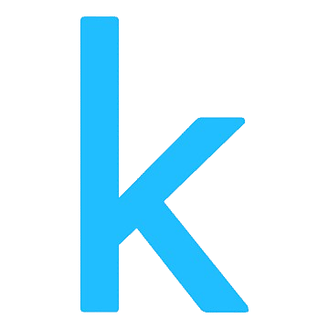

# 

### Connect with Me!!!

 

  
  

    <h4 style="margin-top: 0; margin-bottom: 15px;">Hi, I'm Farneet Singh 👋</h4>
    

      I am a curious ML Researcher and developer focused on creating impactful, intelligent solutions. I enjoy solving complex problems and sharing knowledge.
        
      I am currently working on projects and researching fields such as Emotion Recognition and AI automation, and I'm always ready to push the boundaries of innovation.
    

  

---

## 🚀 My Work

### 🌐 Profiles

| Platform | Profile Links |
|----------|---------------|
|   |  |
|  |  |
|         |  |
|  |  |

 

### 🛠️ Projects

| Project Title | Description | Live Link | Repo Link |
|---------------|-------------|-----------|-----------|
| **Scribble** | NLP-powered writing tool using fine-tuned models for generating summaries and text enhancements. |  |  |
| **ThreadMind** | Comment analysis tool for analyzing and categorizing social media comments. |  |  |
| **Leetcode Company-Wise Tracker** | A platform to track coding progress across companies with problem links and progress-tracking features. |  |  |

 

### 📓 Notebooks

| **Project Title** | **Description** | **Link** |
|------------------|-----------------|----------|
| **Facial Emotion Recognition with CK+ (Pixel Matrices)** | Developed and evaluated multiple machine learning models on the CK+ dataset for facial emotion recognition using pixel matrix representations. |  |
| **Facial Emotion Recognition with CK+ (Image-Based)** | Achieved 96.46% accuracy in facial emotion recognition using a custom-developed Convolutional Neural Network (CNN) model. |  |
| **Dialogue Summarization** | Fine-tuned BART on SAMSUM and DialogSUM datasets to generate concise summaries of chat conversations. |  |
| **Sentiment Analysis** | Fine-tuned RoBERTa on Twitter and Reddit comments, achieving 93% test accuracy in sentiment classification. |  |
| **Cyberbullying Detection** | Fine-tuned XLNet on 100k comments for cyberbullying detection, achieving 99% accuracy and precision. |  |
| **Noise Removal with Deblurring GANs** | Designed a pipeline for face detection and noise removal using advanced GAN-based deblurring techniques. |  |

---

## My Skills

---

### GitHub Stats

 

